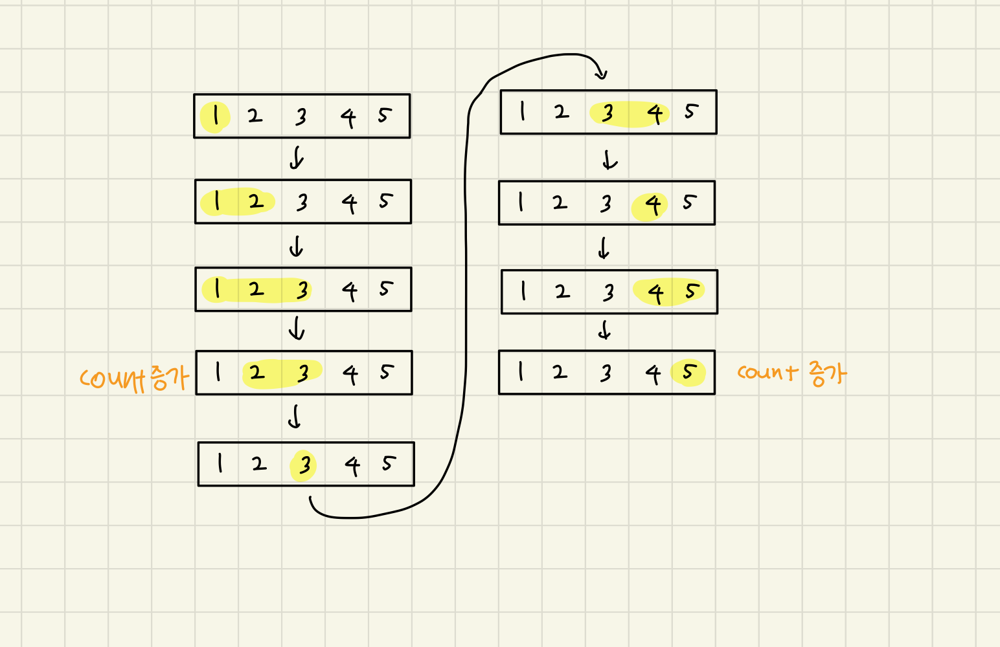

# 20250328 회고록 
## 📌2167번. 2차원 배열의 합 
- 아직 해결 못 함 ㅠ.ㅠ
### 나의 풀이. 속한 배열 순회 
- i == x 이면, sum(arr[i][j:y+1])
- i != x 이면, 처음 행 + 중간 행 + 끝 행에 속한 원소 값을 모두 더해주면 된다.
- 문제점: 예제에서 1 3 2 3으로 입력이 주어질 때 출력결과가 36이라는데, 난 60이 맞는 것 같다.. 이해가 안되네ㅠㅠ 
```python
n, m = map(int, input().split())
arr = [list(map(int, input().split())) for i in range(n)]

for _ in range(int(input())):
    i, j, x, y = map(int, input().split())
    i -= 1; j -=1; x-=1; y-=1
    total = 0 
    
    if i != x:
        # 처음 행
        total += sum(arr[i][j:])
        # 끝 행
        total += sum(arr[x][:y+1])
        # 중간 행
        for k in range(i+1, x):
            total += sum(arr[k][:])
        # row = i 
        # while True: 
        #     if row == x: 
        #         print("1 {}".format(arr[x][:y+1]))
        #         total += sum(arr[x][:y+1])
        #         break 
        #     elif row == i:
        #         print("2 {}".format(arr[row][j:]))
        #         total += sum(arr[row][j:])
        #     elif i < row and row < x:
        #         print("3 {}".format(arr[row][:]))
        #         total += sum(arr[row][:])
        #     row += 1
    else: 
        total = sum(arr[i][j:y+1])
    print(total)
```

## 11728번. 배열 합치기 
무난하게 풀었다! 그냥 두 리스트 입력 받고 + 연산해서 sort()

## 13241번. 최소공배수
lcm이 최소공배수, gcd는 최대공약수 !!!
```python
def gcd(a,b):
    while b:
        a, b = a, a%b
    return a
def lcm(a,b):
    return (a*b)//gcd(a,b)
```
## 🍀14916번. 거스름돈
- 5와 2를 번갈아 가면서 빼야 한다는 아이디어
- 코드에서 주의할 점: else문은 while문이 정상적으로 종료되지 않고 조건을 더 이상 만족하지 않는 경우, 즉 n < 0일 때 실행된다. 이때는 거스름돈을 정확히 맞출 수 없는 상황이므로 -1을 출력하는 것것.
### 기존 내 코드 
5로 나눈 나머지가 2로 나눴을 때도 0이 안되면 -1을 출력하면 된다고 생각했다. 
그런데? 18을 보면 5로 나눈 나머지가 3, 위의 아이디어에 따르면 -1이어야 하는데 18 -> 13 -> 8에서 멈추고 2로만 해결하면 거슬러줄 수 있다. 
이런 예외에서 또 틀렸고.. 좋은 생각이 안 나서 결국 구글링..ㅎㅎㅎ
```python 
n = int(input())
if (n%5)%2 != 0:
    print(-1)
else:
    cnt = 1
    n -= 5 
    while True: 
        if n%2 == 0:
            break 
        n -= 5
        cnt += 1
    print(cnt + n//2)
```
## 📌2740번. 행렬 간의 곱셈 
행렬 간의 곱셈 원리를 이해하니까 단번에 품 !! 
기억해야 할 건 딱 한 줄 !!
```plain text
C = [c_ik] = [a_i1*b_1k + a_i2*b_2k + .. + a_iN*b_1N]
C의 크기는 M x P
```
### 🍀행렬 간의 덧셈/곱셈
행렬 A, B가 있다고 해보자 
1. 행렬 간의 덧셈
   - 덧셈의 경우, 두 개의 행렬의 크기는 같아야 한다. 
   - A = [a_ij], B = [b_ij]일 때 `A+B의 [c_ij] = [a_ij + b_ij]`
2. 행렬 간의 곱셈
   - `A의 크기 = M x N, B의 크기 = N x P`
   - 곱셈의 경우, 행렬 A의 열 개수와 B의 행 개수가 같아야 한다. 
   - A = [a_ij], B = [b_ij]일 때 곱셈 C = AB는 다음과 같이 정의된다. 
   - `C = [c_ik] = [a_i1*b_1k + a_i2*b_2k + .. + a_iN*b_1N]`
   - `C의 크기는 M x P`

## 2161번. 카드1
리스트 자료구조의 pop과 len을 이용해 구현한다.

## 10867번. 중복 빼고 정렬하기 
set()를 활용하면 쉽게 해결 가능한 문제 !

## ✨ 1543번. 문서 검색
### 틀린 나의 풀이 
왜 틀렸는지 모르겠겠어요..
```python 
string = input()
f = input()
count = 0

while True: 
    v = string.find(f, index)
    if v != -1:
        string = string.replace(f, "", 1)
        # print(string)
        count += 1
    else: 
        break 
print(count)
```
### 다른 풀이: count()함수 
- 문자열 내부에서 특정 문자 혹은 문자열이 포함되어 있는지 계산해서 반환해주는 함수
- 문자열 내에서 자신이 찾고자 하는 문자의 개수 
```python
string = input()
f = input()

print(string.count(f))
```

## 2822번. 점수 계산
문제를 잘 읽고 어느 부분을 어떻게 출력하는지 
흔한 리스트 활용 구현 문제였다. 

## 📌 2018번. 수들의 합 
### 시간 초과 풀이
```python 
N = int(input())

# 연속된 자연수의 합 == N이 되는 가짓수 

count = 0
for start in range(1, N+1):
    total = 0
    # li = []
    for j in range(start, N+1):
        # print("j = {}".format(j))
        total += j
        # li.append(j)
        if total == N:
            count += 1
            # print(li)
            # print(count, total)
            break 
print(count)
```

### 🍀시간초과 풀이: 연속된 자연수들의 합 구하는 수학 공식
- `a + (a+1) + (a+2) + .. + (a+k-1) = N`
- k개의 숫자들의 합이 N과 같다고 할 때 이 식을 간단히 변형하면 아래와 같다. 
- `k * (2a + k - 1) / 2 = N` 
- 따라서 k를 1부터 시작해 점차 증가시키되, 각 k에 대해 연속된 자연수들의 합이 N이 되는지 확인해야 한다. 
- 이때 `1 <= k <= (N // 2 + 1)`; 그 이유는 연속된 자연수들의 합이 N을 초과할 수 없기 때문이다. 

이렇게 풀어도 시간초과 발생.. 
```python 
N = int(input())
count = 0
for i in range(1, N+1):
    for k in range(1, N//2+1):
        if k*(2*i + k -1) // 2 == N: 
            count += 1
            break 
print(count)
```

### 정답 풀이: 투포인터 풀이 
**📌투포인터 알고리즘**
1. 시작점과 끝점이 첫 번째 원소의 인덱스를 가리키게 한다.
2. 현재 부분 합이 n이면 count 증가, start 증가
3. 현재 부분 합이 n보다 크면 start 증가
4. 현재 부분 합이 n보다 작으면 end 증가
5. 2~4번 반복


.. 구현은 내일 다시 해보는 걸로 !!