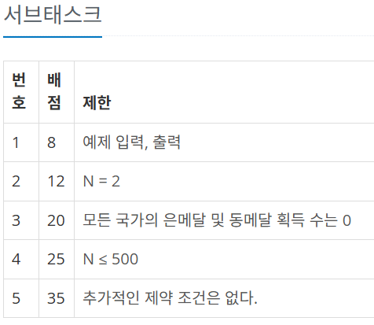

# 20250330 회고록 
## 📌 2018번. 수들의 합 5
연속하는 자연수의 합을 구하는 방법
```plain text
 수학적으로도 풀이가 가능한 것 같지만 투 포인터로 해결했다.
 
 start와 end 인덱스를 모두 0으로 지정해두고, 
 
 만약 총합이 n보다 작다면 end를 늘리고 end만큼 합을 추가한다.

 만약 총합이 n보다 커진다면 현재 start만큼 빼주고 start를 1 늘린다.

 마침내 총합이 n과 같다면 성공적인 조합이므로 카운트한다.
 
 그리고 다음 조합을 구해야 하므로 마찬가지로 end를 늘리고 end만큼 합을 추가한다.
 
 end가 n보다 커졌다면 범위를 넘은 것이므로 종료한다.
``` 

## 📌8979번. 올림픽
### 8점/100점 풀이.. 
금은동을 문자열로 묶어 비교하려고 state, a-c를 따로 받아 li에 추가하고, 금은동 문자열을 기준으로 내림차순 정렬을 했다. 

그 뒤에는 등수는 rank = 1로 두고, 현재 최대 금은동 값을 max_에 저장해둔다. 
이때 1등 나라의 금은동 값으로 max_를 초기화한다. 

그럼 2번째 나라부터 max_와 비교해서, 
- 만약 금은동 값이 같으면 rank 값을 올리지 말고, 
- 다르면 rank + 1 을 한다. 
- 이때 i 나라가 찾던 K이면 현재 rank값을 출력하고 종료한다. 

문제점

- 아래 서브 테스크에서 1번밖에 만족을 못했다. 
- 특정 국가의 등수를 잘못 계산한 모양이었다. 
```plain text
2 1
1 3 0 0 
2 3 0 0
```
위의 테스트 케이스를 실행하면 아무것도 출력되지 않는다. 그 이유는 2번째 나라부터 rank 카운팅을 하기 때문이다. 
```plain text
4 3
1 2 0 0
2 2 0 0
3 4 0 0
4 1 0 0
```
서브 테스크 3번을 만족하는 입력값이지만, 위의 테스트 케이스에서 또한, 3은 1등 국가인데 rank 출력 for문이 2등 나라부터 시작하므로 아무것도 출력되지 않는다. 

```python 
N, K = map(int, input().split())
li = []
for _ in range(N):
    state, a, b, c = map(int, input().split())
    li.append([state, ''.join(map(str, [a,b,c]))])
li.sort(key=lambda x:(x[1]), reverse=True)
# print(li)
rank = 1
max_ = li[0][1]
# print('300'>'020', '010'>'001', '01')
for i in range(1,N):
    c, score = li[i]
    if max_ == score: 
        pass
        # rank pass 
    elif max_ > score: 
        rank += 1
        max_ = score
    # print(max_, score, rank)
    if K == c: 
        print(rank)
        break 
```

## 옳은 풀이
```python 
N, K = map(int, input().split())
medals = [list(map(int, input().split())) for _ in range(N)]
# 금은동 순으로 내림차순 정렬
medals.sort(key=lambda x:(x[1], x[2], x[3]), reverse = True)

# 국가 넘버 중 K값의 위치 인덱스 찾기 
idx = [medals[i][0] for i in range(N)].index(K)

# 해당 인덱스와 메달 수가 동일한 국가를 찾아 해당 인덱스 + 1
for i in range(N):
    if medals[idx][1:] == medals[i][1:]:
        print(i+1)
        break 
```
위의 풀이에서 가장 이해가 어려웠던 부분은 마지막 for문이었는데, 

동일한 금은동을 가진 나라가 있다고 하자. 
본인보다 앞서 위치한 나라와 금은동이 같아 if문에 걸리게 되면, 그 나라와 같은 등수를 가지기 때문에 앞선 나라의 index에 1을 더해 등수를 더하면 그것이 답이 된다. 

동일한 금은동을 가진 나라가 없다고 하더라도, 
본인 index 값에 1을 더한 값이 실제 등수이다. 

따라서, 이 풀이는 외워두면 좋을 듯!!!

## 📌2669번. 직사각형 네개의 합집합의 면적 구하기
- 2563번 문제와 차이가 있다 !! 
- **좌표를 구하는 건지, 박스를 구하는 건지 그 차이를 알아야 한다.** 그 차이는 예제를 직접 계산해보고, 느껴야 한다.. 그래서 예제를 꼭 한 개는 제대로 파악하라는 건가보다. 

## 1343번. 폴리오미노 
- 그리디 문제라고 한다. 
문자열 구현 문제, 'AAAA'와 'BB'를 이용해 기존의 문자열을 대체하는 거였다. 

이때 '.'로 분리된 각 문자열들에 대해서, 그 문자열의 길이가 2, 4 또는 2와 4의 공배수인 경우를 찾아야 했다. 

2, 4는 쉽게 풀었고, 공배수인 경우는 len(str)%4%2 == 0인 경우로 잡았다. 

while문에서 str의 길이가 4 이상인 경우에는 우선적으로 'AAAA'로 대체하도록 하고, 그 아래가 되면 'BB'로 대체하도록 했다. 

단, 대체할 때 기존의 str는 ''로 replace하고, 'AAAA'와 'BB'는 tmp에 추가해서 while문이 종료되면 최종적으로 result에 추가했다. 

## 다른 풀이 
```python 
board = input()

board = board.replace("XXXX", "AAAA")
board = board.replace("XX", "BB")

if 'X' in board:
    print(-1)
    
else:
    print(board)
```
사실 해당 문제는 'AAAA', 'BB'로 몇 번 교체되는지 궁금한 건 아니기 때문에 위와 같이 풀어도 되는구나 생각이 든다.. ㅎㅎ

## 9656번. 돌 게임2 
전에 풀었던 돌게임1과 동일한 풀이로 간다. 
이 경우에는 게임의 규칙 파악이 우선 !! 

## 📌5635번. 생일 
- 주의할 점 !!
- `'12' < '9' => True` 이지만, `12 > 9 => True`라는 점 !! 

## 13909번은 내일..!