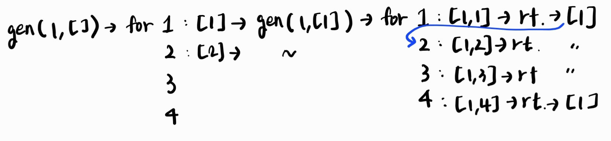

# 20250421 회고록 

## 9461. 파도반 수열 
- 수열의 규칙을 파악하고, 점화식을 세워 메모제이션 기법으로 해결하면 쉽게 해결할 수 있다. 

## 11727. 2xn 타일링 2
지난번 2xn 타일링1에서 살짝 응용된 문제이다. 

n=1,2,3,4일때를 그려보면서 규칙을 찾고, 점화식을 세워 메모제이션 기법으로 풀면 간단하다. 

## 📌15652. N과 M(4)

- 백트래킹 문제였다. 
- M번 재귀하기 위해선, start라는 매개변수 추가하는 것이 핵심이었다. 
- 다시 풀어볼 필요가 있는 문제

## 1966. 프린터 큐 
- deque 모듈을 사용했다.
- (문서 번호, 중요도) 쌍으로 큐에 저장해두고, 큐가 빌 때까지 아래 순서를 반복하면 된다.  

순서: 
1. max_v <- 큐에서 중요도가 가장 높은 값을 찾는다.
2. i, score <- 큐의 맨 앞에 있는 쌍을 꺼낸다. (번호, 중요도)
3. 만약 score != max_v 라면, 즉 중요도가 가장 높은 것이 아니라면 맨 뒤에 다시 넣는다. 
4. score == max_v 라면, 즉 중요도가 가장 높은 문서면 pop()하므로 cnt를 센다. 이때 문서 번호가 M(궁금한 번호)이면 cnt를 출력하고, 종료한다.

## 📌1002. 터렛
- 처음에는 좌표 상의 정수 값으로만 생각해서 무한대가 어떻게 나오지 고민했다. 
- 근데 원으로 생각하면, 두 원이 완전히 같을 때 교차점 개수가 무한대가 가능하다.  따라서 원의 외접, 내접, 접하지 않는 경우, 완전히 가은 경우, 교차하는 경우로 나눠 생각하면 된다. 
- **경우의 수를 정확히 먼저 나누고 코딩을 하자.** 안 그러면 코드 보고 혼자 헷갈려서 경우 빼먹는다.

## 15651. N과 M(3)
중복이 가능하고, 모든 수에 대해서 1부터 N까지의 조합이 필요하다.

따라서, used는 필요하지 않고, generate()는 for문에서 1부터 N까지 모든 경우에 대해 generate()를 실행하면 된다. 

